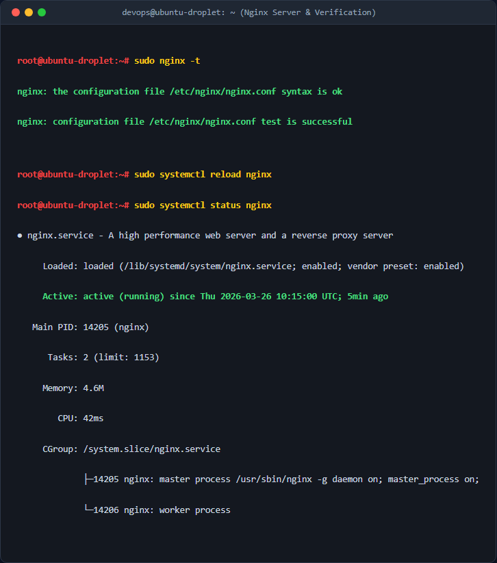
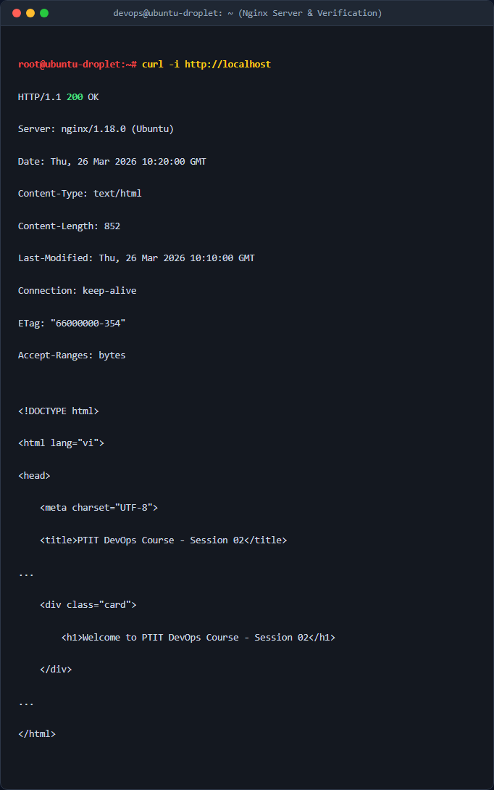

# Báo cáo kỹ thuật: Cài đặt Nginx và cấu hình Website tĩnh cơ bản (Basic Nginx Web Server)

## 1. Mục tiêu & Bối cảnh kỹ thuật

### Bối cảnh
Trong hạ tầng DevOps, việc triển khai một dịch vụ Web Server để phục vụ ứng dụng web tĩnh hoặc làm lớp Reverse Proxy phía trước các ứng dụng Backend là yêu cầu cơ bản. Bài thực hành thực hiện thiết lập một website giới thiệu cho chương trình đào tạo PTIT trên máy chủ Linux Ubuntu Server thông qua HTTP Web Server Nginx.

### Mục tiêu kỹ thuật
- Cài đặt dịch vụ Nginx phiên bản ổn định từ APT repository chuẩn của Ubuntu.
- Xây dựng cấu trúc thư mục mã nguồn tĩnh độc lập tại `/var/www/ptit-web/html/`.
- Cấu hình file **Server Block** riêng biệt tại `/etc/nginx/sites-available/ptit-web.conf`.
- Kích hoạt Virtual Host bằng Symbolic Link (symlink) và hủy bỏ trang mặc định (`default`) để loại bỏ nguy cơ xung đột cổng HTTP 80.
- Kiểm tra cú pháp cấu hình và xác minh khả năng phản hồi dịch vụ.

---

## 2. Các bước thực hiện chi tiết

### Bước 1: Cập nhật danh sách gói và cài đặt Nginx
Cập nhật danh mục gói phần mềm để đảm bảo cài đặt bản cập nhật mới nhất từ repository:
```bash climate
sudo apt update && sudo apt install -y nginx
```
*Giải thích tham số:*  
- `apt update`: Cập nhật lại chỉ mục danh sách các gói phần mềm hệ thống.
- `-y`: Tự động đồng ý xác nhận cài đặt các gói phụ thuộc.

### Bước 2: Tạo cấu trúc thư mục chứa mã nguồn trang web
Tạo thư mục chứa tài nguyên trang web static theo đường dẫn yêu cầu:
```bash
sudo mkdir -p /var/www/ptit-web/html
```
*Giải thích tham số:*  
- `-p` (`--parents`): Tạo các thư mục cha nếu chưa tồn tại mà không báo lỗi.

Phân quyền sở hữu thư mục cho user `www-data` (user mặc định thực thi Nginx):
```bash
sudo chown -R www-data:www-data /var/www/ptit-web
sudo chmod -R 755 /var/www/ptit-web
```
*Giải thích tham số:*  
- `-R`: Áp dụng đệ quy cho toàn bộ thư mục và tệp tin con.
- `755`: Owner có toàn quyền (Read/Write/Execute), Group và Others có quyền Read/Execute.

### Bước 3: Tạo trang web static `index.html`
Tạo file `/var/www/ptit-web/html/index.html` với nội dung:
```bash
sudo tee /var/www/ptit-web/html/index.html > /dev/null << 'EOF'
<!DOCTYPE html>
<html lang=

## Ảnh chụp màn hình kết quả thực nghiệm



## Ảnh chụp màn hình kết quả thực nghiệm

